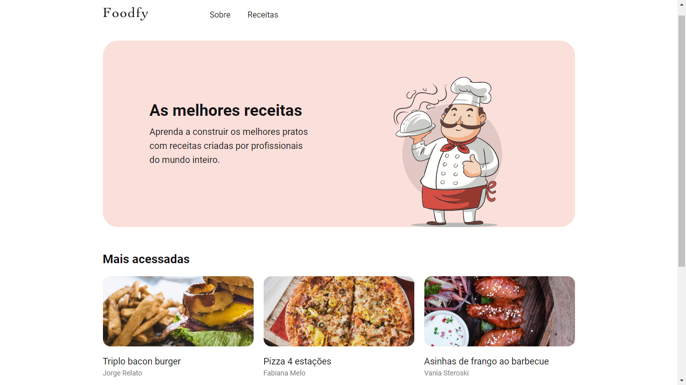
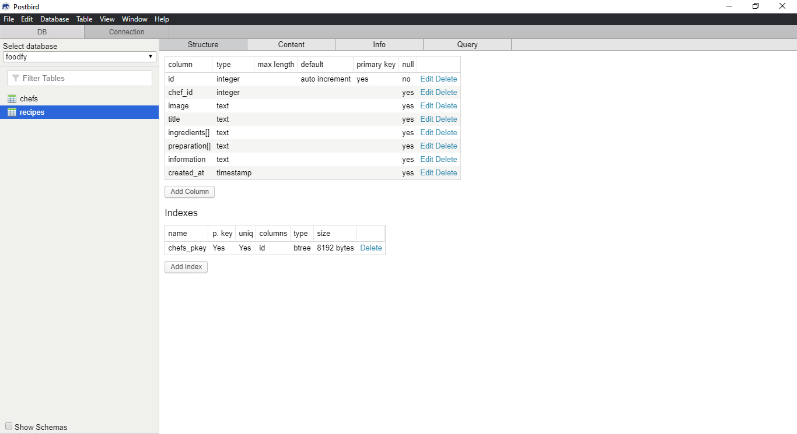
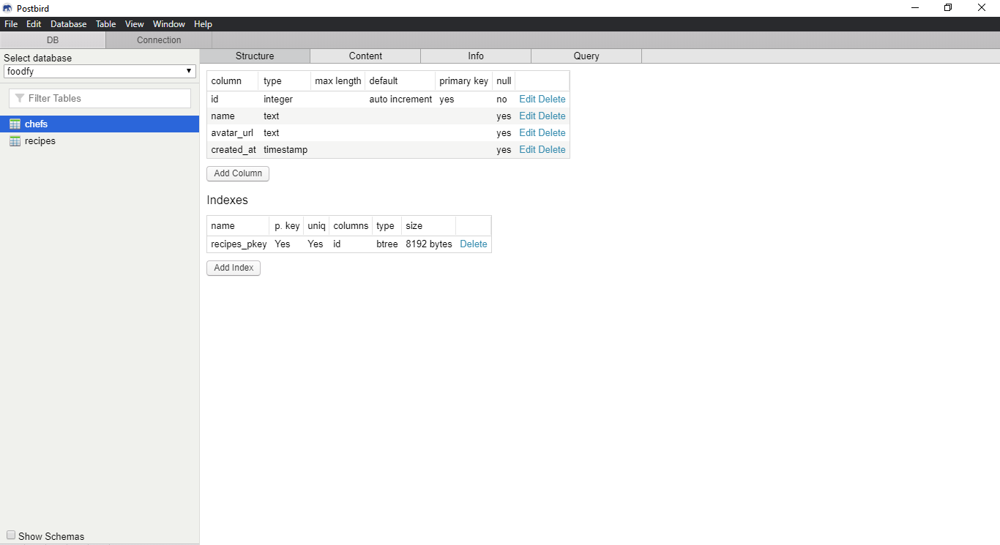

# Foodfy &#127829;

*Esse foi um projeto desenvolvido com a intenção de aprender novas tecnologias e exercitar conceitos.*

## Objetivo &#127919;

Foodfy é um site de receitas que visa ensinar ao internauta fazer comidas deliciosas e possibilitar as pessoas a compartilharem sus segredos culinários.

## Desafios

Segue uma tabela com os desafios do Foodfy caso você queira replicá-lo por si mesmo.

| Feito?   | Desafio                                                      |
| -------- | ------------------------------------------------------------ |
| &#9989;  | [01 - Construindo o Foodfy](https://github.com/Rocketseat/bootcamp-launchbase-desafios-02/blob/master/desafios/02-foodfy.md) |
| &#9989;  | [02 - Refatorando o Foodfy](https://github.com/Rocketseat/bootcamp-launchbase-desafios-03/blob/master/desafios/03-refatorando-foodfy.md) |
| &#9989;  | [03 - Administração do Foodfy](https://github.com/Rocketseat/bootcamp-launchbase-desafios-04/blob/master/desafios/04-admin-foodfy.md) |
| &#10062; | [04 - Persistindo Dados no Foodfy](https://github.com/Rocketseat/bootcamp-launchbase-desafios-05/blob/master/desafios/05-persistindo-dados-foodfy.md) |
| &#10062; | [05 - Envio de Imagens no Foodfy](https://github.com/Rocketseat/bootcamp-launchbase-desafios-07/blob/master/desafios/07-foodfy-envio-imagens.md) |
| &#10062; | [06 - Apresentação e Organização de Receitas no Foodfy](https://github.com/Rocketseat/bootcamp-launchbase-desafios-08/blob/master/desafios/08-apresentacao-organizacao-receitas-foodfy.md) |
| &#10062; | [07 - Sistema de Login do Foodfy](https://github.com/Rocketseat/bootcamp-launchbase-desafios-10/blob/master/desafios/10-sistema-login-foodfy.md) |

## Alguns detalhes &#128220;

* O banco de dados usado é o PostgreSQL.
* O backend é construído com Node.JS.
* O fontend é construído com o framework ReactJS.

## Como rodar o projeto em minha máquina? &#129300;

O primeiro passo é clonar o projeto, seja via terminal ou GitHub Desktop, ou mesmo baixando o arquivo compactado (.zip). Após isso, siga adiante.

## Requisitos &#128736;

* Ter o Node.JS instalado.
* Ter o PostgreSQL instalado.
* (Opcional) Ter o Postbird instalado.
* (Opcional) Ter o Yarn instalado.

### Instalando dependências &#128269;

Com o Node.JS instalado, acesse cada um dos diretórios (**server**, **web** e **mobile**) via terminal e rode o comando `npm install`. Caso você prefira usar o Yarn, basta rodar o comando `yarn`.

### Criando banco de dados e tabelas no PostgreSQL &#129405;

Inicie o servidor e utilizando a ferramenta Postbird (ou de outra maneira, caso queira), crie através de queries um banco de dados chamado *foodfy*.

```sql
CREATE DATABASE foodfy
```

Agora, nesse banco de dados crie duas tabelas:

* Pelo Postbird crie uma tabela chamada **recipes** com os seguintes campos:



Ou crie a tabela por meio de queries:

```sql
CREATE TABLE RECIPES(
   ID SERIAL PRIMARY KEY,
   CHEF_ID INT NULL,
   IMAGE TEXT NULL,
   TITLE TEXT NULL,
   INGREDIENTS TEXT[] NULL,
   PREPARATION TEXT[] NULL,
   INFORMATION TEXT NULL,
   CREATED_AT TIMESTAMP NULL
);
```

* Pelo Postbird crie uma tabela chamada **members** com os seguintes campos:



Ou crie a tabela por meio de queries:

```sql
CREATE TABLE CHEFS(
   ID SERIAL PRIMARY KEY,
   NAME TEXT NULL,
   AVATAR_URL TEXT NULL,
   CREATED_AT TEXT NULL,
);
```

### Configurando conexão com o servidor &#129520;

Dentro da pasta do projeto entre em */src/config* e abra o arquivo *db.js* em uma IDE ou editor de código.

No arquivo, altere as informações de **user** e **password** (entre outras) de acordo com a configuração feita no PostgreSQL.

### Definitivamente rodando o projeto! &#10024;

Se tudo deu certo, agora basta acessar a pasta do projeto pelo terminal e digitar o comando `npm start`. Uma aba será aberta no seu navegador padrão com o projeto rodando!
