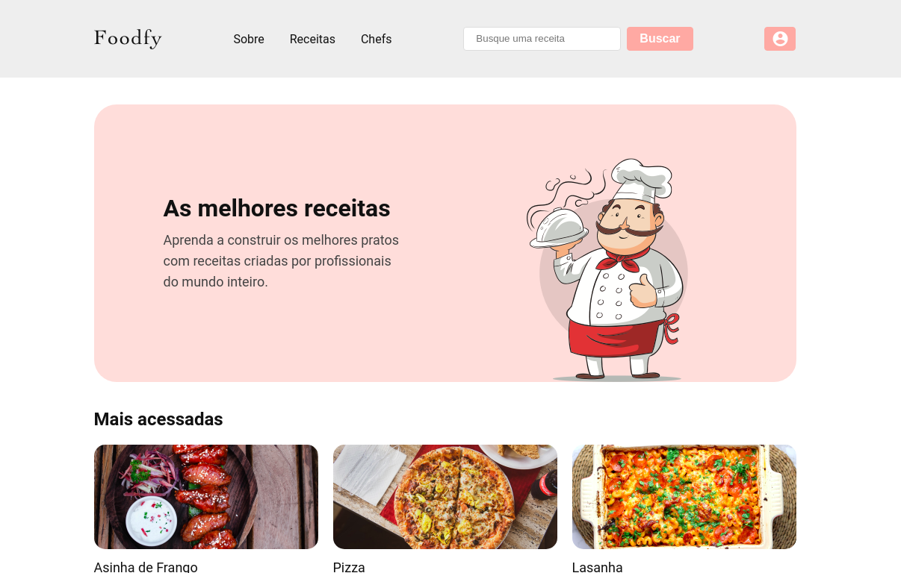

# :pizza: Foodfy

> Esse foi um projeto desenvolvido com a intenção de aprender novas tecnologias e exercitar conceitos.

## :dart: Goal

Foodfy is a recipe site that aims to teach internet users how to make delicious foods and enable people to share their cooking secrets.

## :pushpin: Challenges

Below is a table with Foodfy's challenges in case you want to replicate it yourself.

| Done?              | Challenge                                                    |
| ------------------ | ------------------------------------------------------------ |
| :white_check_mark: | [01 - Building Foodfy](https://github.com/Rocketseat/bootcamp-launchbase-desafios-02/blob/master/desafios/02-foodfy.md) |
| :white_check_mark: | [02 - Refactoring Foodfy](https://github.com/Rocketseat/bootcamp-launchbase-desafios-03/blob/master/desafios/03-refatorando-foodfy.md) |
| :white_check_mark: | [03 - Foodfy Administration](https://github.com/Rocketseat/bootcamp-launchbase-desafios-04/blob/master/desafios/04-admin-foodfy.md) |
| :white_check_mark: | [04 - Persisting Data on Foodfy](https://github.com/Rocketseat/bootcamp-launchbase-desafios-05/blob/master/desafios/05-persistindo-dados-foodfy.md) |
| :white_check_mark: | [05 - Uploading Images on Foodfy](https://github.com/Rocketseat/bootcamp-launchbase-desafios-07/blob/master/desafios/07-foodfy-envio-imagens.md) |
| :white_check_mark: | [06 - Presentation and Organization of Recipes on Foodfy](https://github.com/Rocketseat/bootcamp-launchbase-desafios-08/blob/master/desafios/08-apresentacao-organizacao-receitas-foodfy.md) |
| :white_check_mark: | [07 - Foodfy Login System](https://github.com/Rocketseat/bootcamp-launchbase-desafios-10/blob/master/desafios/10-sistema-login-foodfy.md) |

## :scroll: Some details 

- The back-end is built with Node.JS and PostgreSQL.
- The font-end is built with ReactJS.

## :thinking: How do I run the project on my machine?

The first step is to clone the project, either via terminal or GitHub Desktop, or even by downloading the compressed file (.zip). After that, go ahead.

### :hammer_and_wrench: Requirements

- [Node.JS](https://nodejs.org/).
- [PostgreSQL](https://www.postgresql.org/).
- (Optional) [Yarn](https://yarnpkg.com/).
- (Optional) [Postbird](https://www.electronjs.org/apps/postbird).

### :mag: Installing dependencies

With Node.JS installed, access the project directory via terminal and run the command `npm install`. If you prefer to use Yarn, just run the `yarn` command.

### :game_die: Creating Databases and Tables in PostgreSQL

Start the database and create through the queries below a database called *foodfy*.

```sql
-- Criação do banco de dados

DROP DATABASE IF EXISTS foodfy;

CREATE DATABASE foodfy;

-- Criação de tabelas

-- -- Receitas

CREATE TABLE recipes (
   id SERIAL PRIMARY KEY,
   chef_id INT NULL,
   title TEXT NULL,
   ingredients TEXT[] NULL,
   preparation TEXT[] NULL,
   information TEXT NULL,
   views INT DEFAULT(0),
   created_at TIMESTAMP DEFAULT(now()),
   updated_at TIMESTAMP DEFAULT(now())
);

-- -- Chefs

CREATE TABLE chefs (
   id SERIAL PRIMARY KEY,
   name TEXT NULL,
   created_at TIMESTAMP DEFAULT(now())
);

-- -- Usuários

CREATE TABLE users (
  id SERIAL PRIMARY KEY,
  name TEXT NOT NULL,
  email TEXT UNIQUE NOT NULL,
  password TEXT NOT NULL,
  reset_token TEXT,
  reset_token_expires TEXT,
  is_admin BOOLEAN DEFAULT false,
  created_at TIMESTAMP DEFAULT(now()),
  updated_at TIMESTAMP DEFAULT(now())
);

-- -- Arquivos

CREATE TABLE files (
  id SERIAL PRIMARY KEY,
  name TEXT NULL,
  path TEXT NOT NULL,
  chef_id INT NULL,
  recipe_id INT NULL
);


-- Chaves estrangeiras

ALTER TABLE "recipes" ADD FOREIGN KEY ("chef_id") REFERENCES "chefs" ("id");

-- Procedure e trigger para atualizar a hora de atualização de receitas e usuários

CREATE FUNCTION trigger_set_timestamp()
RETURNS TRIGGER AS $$
BEGIN
	NEW.updated_at = NOW();
  RETURN NEW;
END;
$$ LANGUAGE plpgsql;

CREATE TRIGGER set_timestamp
BEFORE UPDATE ON recipes
FOR EACH ROW
EXECUTE PROCEDURE trigger_set_timestamp();

CREATE TRIGGER set_timestamp
BEFORE UPDATE ON users
FOR EACH ROW
EXECUTE PROCEDURE trigger_set_timestamp();

-- Tabela e configs para o controle de sessão (connect-pg-simple)

CREATE TABLE "session" (
  "sid" varchar NOT NULL COLLATE "default",
	"sess" json NOT NULL,
	"expire" timestamp(6) NOT NULL
)
WITH (OIDS=FALSE);

ALTER TABLE "session" ADD CONSTRAINT "session_pkey" PRIMARY KEY ("sid") NOT DEFERRABLE INITIALLY IMMEDIATE;

CREATE INDEX "IDX_session_expire" ON "session" ("expire");
```

### :e-mail: Configuring Nodemailer

Access the *src/lib/mailer.js* file and open it in the editor of your choice. Change **user** and **pass** parameters according to your SMTP server.

### :toolbox: Setting up server connection

Inside the project folder enter *src/config* and open the *db.js* file in an IDE or code editor.

In the file, change the **user** and **password** information (among others) according to the configuration made in PostgreSQL.

### :dizzy: Definitely running the project!

If everything went well, now just access the project folder from the terminal and type the command `npm start` or `yarn start`. A tab will open in your default browser with the project running!

## :tada: If everything went well...

Now you are running the project beautifully!

## :memo: License

This project is under the MIT license. See the [LICENSE](LICENSE) for more information.

---

Made with :green_heart: by Lucas Coutinho :wave: [Get in touch!](https://www.linkedin.com/in/lucasmc64/)